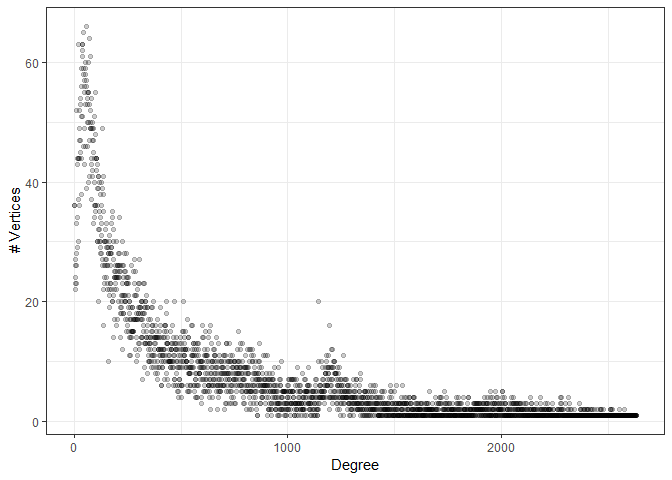
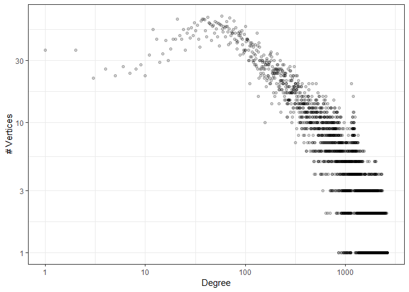
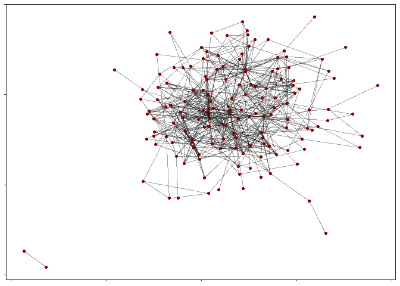

Functional Resources
================

When analyzing omics data, functional resources can help putting gene or protein results in a biological context. We are now going to analyze a set of genes associated with type 2 diabetes according to Fernández-Tajes et al. [(1)](#references).

Pathway Analysis
----------------

Pathway analysis gather biological interactions in the form of pathways that are organized based on textbook biology. [Reactome](reactome.org) is a reference database for curated biological interaction.

:pencil2: Go to *Reactome*, select *Analyze Data*, and analyze the list of genes available [here](resources/T2D_genes.txt).

:speech\_balloon: *Can you relate the overrepresented pathways to type 2 diabetes?*

Network view
------------

Protein networks can be built from pathway databases and other sources of knowledge on protein-protein interactions.[String](string-db.org) gathers interactions from various sources and provides a score image of the reliability of the interaction.

``` r
stringDF <- read.table(file = "resources/9606.protein.links.v10.5.txt.gz", header = T, stringsAsFactors = F)
```

If you look at the data frame, you will see that it contains two columns for the interacting proteins, and a score for the interaction. Note that the proteins are named using the taxonomy number and Ensembl identifier. We are now going to build a graph using this table. For this, we need the `igraph` package. We will also need the `ggplot2` package to draw plots, and `ggraph` to plot graphs.

``` r
library("igraph")
```

    ## 
    ## Attaching package: 'igraph'

    ## The following objects are masked from 'package:stats':
    ## 
    ##     decompose, spectrum

    ## The following object is masked from 'package:base':
    ## 
    ##     union

``` r
library("ggplot2")
library("ggraph")

theme_set(theme_bw(base_size = 11))
```

A graph can be built from the data frame.

``` r
stringGraph <- graph_from_data_frame(d = stringDF, directed = F)
```

We can access the vertices and edges of the graph, ie the nodes and connections of the network, using the `V` and `E` functions, respectively. We can for example export the number of vertices and edges.

``` r
length(V(stringGraph))
```

    ## [1] 19576

``` r
length(E(stringGraph))
```

    ## [1] 11353056

:pencil2: In average, how many edges are there per vertex?

The number of edges per vertex is named the *degree* of a vertex. The degree distribution of a graph is a very important structural information [(2)](#references).

``` r
stringDegree <- degree(graph = stringGraph)
stringDegreeDistribution <- as.data.frame(table(stringDegree))
names(stringDegreeDistribution) <- c("Degree", "Frequency")
stringDegreeDistribution$Degree <- as.numeric(stringDegreeDistribution$Degree)

degreePlot <- ggplot() + 
    geom_point(data = stringDegreeDistribution, mapping = aes(x = Degree, y = Frequency), alpha = 0.2) + 
    xlab("Degree") + ylab("# Vertices")

plot(degreePlot)
```



As you can see, we have many nodes with low degree, and few nodes of very high degree. In order to view these very big differences, we can use log scales.

``` r
degreePlot <- ggplot() + 
    geom_point(data = stringDegreeDistribution, mapping = aes(x = Degree, y = Frequency), alpha = 0.2) + 
    xlab("Degree") + ylab("# Vertices") +
    scale_x_log10() + scale_y_log10()

plot(degreePlot)
```



:speech\_balloon: *How do you interpret this degree distribution?*

We are now going to see how the T2D genes are connected in the network. First, we load the T2D genes and convert the gene names into String identifiers using the Uniprot identifier mapping.

``` r
t2dDF <- read.table("resources/T2D_genes.txt", header = T, stringsAsFactors = F)

uniprotIdMapping <- read.table("resources/HUMAN_9606_idmapping.dat.gz", header = F, stringsAsFactors = F, sep = "\t")
names(uniprotIdMapping) <- c("accession", "db", "id")

uniprotAccessions <- unique(uniprotIdMapping$accession[uniprotIdMapping$db == "Gene_Name" & uniprotIdMapping$id %in% t2dDF$Gene])
ensemblAccessions <- unique(uniprotIdMapping$id[uniprotIdMapping$db == "Ensembl_PRO" & uniprotIdMapping$accession %in% uniprotAccessions])

stringAccessions <- paste0("9606.", ensemblAccessions)
```

:pencil2: What is the number of proteins obtained from the gene names?

We can extract the edges in String that start and end among these proteins and plot the network obtained.

``` r
t2dSubnetwork <- stringDF[stringDF$protein1 %in% stringAccessions & stringDF$protein2 %in% stringAccessions, ]

t2dGraph <- graph_from_data_frame(t2dSubnetwork)

t2dGraphPlot <- ggraph(t2dGraph, layout = 'kk') + 
    geom_edge_link(alpha = 0.2) + 
    geom_node_point(col = "darkred") +
    theme(axis.title = element_blank(),
          axis.text = element_blank(),
          panel.grid = element_blank())

plot(t2dGraphPlot)
```



As you can see, most proteins are connected in the String network. We now evaluate the distance between the different vertices in the graph.

``` r
indices <- which(V(stringGraph)$name %in% stringAccessions)

t2dDistances <- distances(graph = stringGraph, v = indices, to = indices, weights = NA)
```

:pencil2: What is the maximal distance between two T2D proteins in the String network?

References
----------

1.  [Developing a network view of type 2 diabetes risk pathways through integration of genetic, genomic and functional data](https://www.biorxiv.org/content/early/2018/06/21/350181)
2.  [Network Science](http://networksciencebook.com/)
